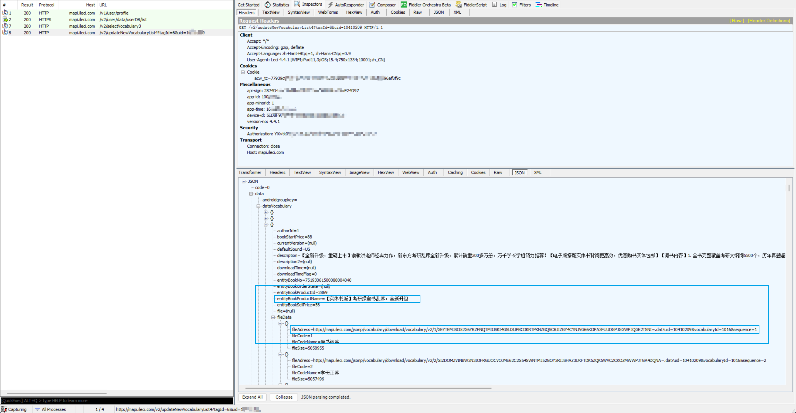

# leci2anki
新东方乐词app中的词书提取, 使用海词接口获取词条解释制作Anki单词卡
----
## 最终词卡效果

## 整体思路和实现过程
### 1. 乐词词书处理

#### 已经上架的词书链接提取

- 通过抓包可以发现打开词书购买界面时会返回所有词书的下载链接直接通过GET方法可下载为`zip`格式的压缩包.(详见[`下载全部词书.py`]('所有处理代码\词书处理\下载全部词书.py'))
- 这类压缩包密码为5位数字,使用`archpr`直接爆破,可以解压得到类似于`vocabulary_*.db`的sqlite数据库.
- 数据库中有`word`表表示`wordID`和单词之间的对应关系, `vocabulary*`命名的表为书中一定顺序的单词详细信息,我主要使用了表`vocabulary_word_briefdef_mapping`来制作单词卡
- 
#### 个人学习数据库提取

- 抓包发现打开下载学习记录的页面后会获取这样一个json, 其分别对应不同时间上传的学习记录, 该记录储存再阿里云oss, 其访问token由乐词服务器访问, 向乐词服务器访问的过程中携带了一个本地生成的token, 因此暂时无法获得脱离软件下载个人词库的方法. 这里使用中间人攻击获取乐词下载的个人学习数据, 其格式依然为sqlite数据库.
- 个人数据库的相关处理见[`demo.ipynb`]('所有处理代码\demo.ipynb'), 可以从中提取自己的单词学习进度.

### 2. 词卡制作
#### Anki相关介绍
Anki支持导入以`tab`分割的`txt`文件. 因此需要将获取到的单词制作成
`<word> <paraphase>`
的形式. 其中paraphase部分使用html语言,Anki可以使用html语言来制作卡片.

#### 词卡制作
- 使用海词Api来获取每个单词的解释并按照Anki要求制作单词`txt`文件(可在release中下载)
- 导入anki时基于问答题模板新建单词模板
- 导入完成后点击卡片按钮, 分别将`Anki词卡模板`中的`正面.html`, `背面.html`, `anki.min.css`中的内容粘贴到`正面`, `背面`, `样式`选项卡中并预览卡片实际效果.至此完成导入.

## 备注
这个项目是因为买了基本新东方的词书但是乐词背单词里面还需要再次购买词书, 而且词条解析非常简单, 还没有例句, 因此萌生了优化词条的想法, 同时用上了陪伴我整个高三的`Anki`并从零开始基于mdui设计了一个单词卡, 看起来感觉还挺舒服的. 十分感谢海词的接口.

### 目前已知问题:
1. 词书数据库有重复, 导入anki后记得查找重复卡;
2. 只提取了部分新东方词书(强烈建议购买纸书, 纸书写的挺好的, 制作词卡只是为了利用好空闲时间);
3. 海词接口对词组支持不太好, 词卡中基本无词组;
4. 部分单词因为书中将不同形态表示在一起导致海词接口搜索不到.

### Release
release主要为anki的txt可导入文件, 另外附上制作词卡的所有已用单词数据库`所有词书单词.sql`.